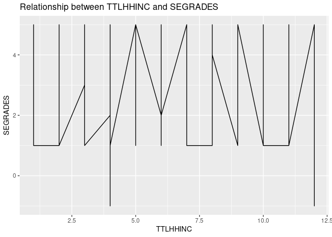
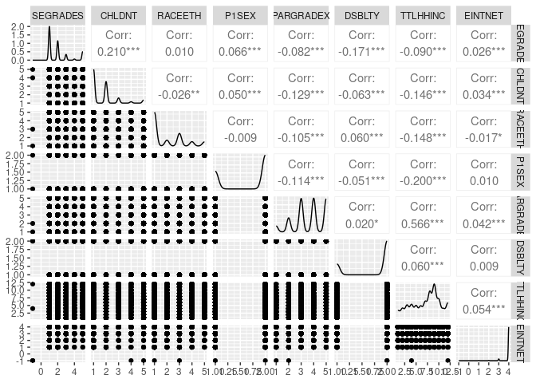
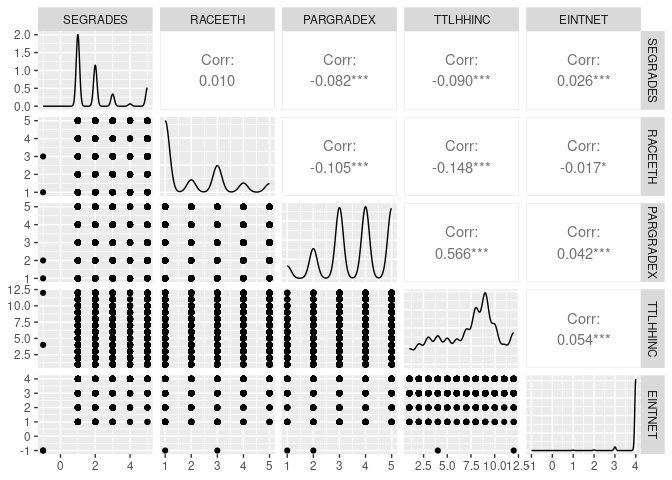

Linear Regression Mini-competition
================

``` r
library(stats)
library(readxl)
library(tidyverse)
```

    ## ── Attaching core tidyverse packages ──────────────────────── tidyverse 2.0.0 ──
    ## ✔ dplyr     1.1.2     ✔ readr     2.1.4
    ## ✔ forcats   1.0.0     ✔ stringr   1.5.0
    ## ✔ ggplot2   3.4.2     ✔ tibble    3.2.1
    ## ✔ lubridate 1.9.2     ✔ tidyr     1.3.0
    ## ✔ purrr     1.0.1     
    ## ── Conflicts ────────────────────────────────────────── tidyverse_conflicts() ──
    ## ✖ dplyr::filter() masks stats::filter()
    ## ✖ dplyr::lag()    masks stats::lag()
    ## ℹ Use the conflicted package (<http://conflicted.r-lib.org/>) to force all conflicts to become errors

``` r
library(ggplot2)
library(tidymodels)
```

    ## ── Attaching packages ────────────────────────────────────── tidymodels 1.1.0 ──
    ## ✔ broom        1.0.4     ✔ rsample      1.1.1
    ## ✔ dials        1.2.0     ✔ tune         1.1.1
    ## ✔ infer        1.0.4     ✔ workflows    1.1.3
    ## ✔ modeldata    1.1.0     ✔ workflowsets 1.0.1
    ## ✔ parsnip      1.1.0     ✔ yardstick    1.2.0
    ## ✔ recipes      1.0.6     
    ## ── Conflicts ───────────────────────────────────────── tidymodels_conflicts() ──
    ## ✖ scales::discard() masks purrr::discard()
    ## ✖ dplyr::filter()   masks stats::filter()
    ## ✖ recipes::fixed()  masks stringr::fixed()
    ## ✖ dplyr::lag()      masks stats::lag()
    ## ✖ yardstick::spec() masks readr::spec()
    ## ✖ recipes::step()   masks stats::step()
    ## • Dig deeper into tidy modeling with R at https://www.tmwr.org

``` r
library(tidyverse)
library(GGally)
```

    ## Registered S3 method overwritten by 'GGally':
    ##   method from   
    ##   +.gg   ggplot2

**Load the data** **Uploaded the data in csv format**

``` r
#load data
df_2019 <- read.csv("k12_2019.csv")
df_2016 <- read.csv("k12_2016.csv")
head(df_2019, 5)
```

    ##       BASMID ALLGRADEX EDCPUB SCCHOICE SPUBCHOIX SCONSIDR SCHLHRSWK EINTNET
    ## 1 2.0191e+10        12      1        2         3        2         4       4
    ## 2 2.0191e+10         4      1        2         3        2         4       3
    ## 3 2.0191e+10        11      2        2         2        1         4       3
    ## 4 2.0191e+10         6      1        1         1        1         4       4
    ## 5 2.0191e+10         9      1        2         3        2         4       4
    ##   MOSTIMPT INTNUM SEENJOY SEGRADES SEABSNT SEGRADEQ FSSPORTX FSVOL FSMTNG
    ## 1       -1     -1       2        1       1        1        2     2      1
    ## 2       -1      2       3        5       1        3        2     1      2
    ## 3        2      2       3        3       1        4        1     1      1
    ## 4       -1     -1       1        1       1        1        1     1      1
    ## 5       -1     -1       2        1       1        1        1     2      1
    ##   FSPTMTNG FSATCNFN FSFUNDRS FSCOMMTE FSCOUNSLR FSFREQ FSNOTESX FSMEMO FCSCHOOL
    ## 1        2        1        1        2         2      2        2      1        2
    ## 2        2        2        2        2         2      2        1      1        1
    ## 3        1        1        2        1         1     20        2      1        4
    ## 4        1        1        1        1         1      3        1      1        1
    ## 5        2        1        1        2         2      5        1      1        1
    ##   FCTEACHR FCSTDS FCORDER FCSUPPRT FHHOME FHWKHRS FHAMOUNT FHCAMT FHPLACE
    ## 1        2      1       2        1      4       2        1      1       1
    ## 2        2      1       1        1      4       7        2      2       1
    ## 3        3      4       4        4      2       6        3      2       1
    ## 4        1      1       1        1      3       5        1      1       1
    ## 5        1      1       1        1      3       5        3      1       1
    ##   FHCHECKX FHHELP FOSTORY2X FOCRAFTS FOGAMES FOBUILDX FOSPORT FORESPON FOHISTX
    ## 1        3      2         1        1       2        1       2        1       1
    ## 2        4      4         1        2       2        2       1        2       1
    ## 3        3      1         1        2       2        1       1        1       1
    ## 4        4      3         1        1       1        1       1        1       1
    ## 5        4      3         2        2       1        1       1        1       1
    ##   FODINNERX FOLIBRAYX FOBOOKSTX HDHEALTH CDOBMM CDOBYY CSEX CSPEAKX HHTOTALXX
    ## 1         7         2         2        1      1   2004    2       2         4
    ## 2         5         2         2        1      8   2012    1       4         9
    ## 3         7         2         2        2      3   2005    1       2         3
    ## 4         7         1         1        1     12   2009    1       4         3
    ## 5         3         2         2        1      5   2006    1       2         4
    ##   RELATION P1REL P1SEX P1MRSTA P1EMPL P1HRSWK P1MTHSWRK P1AGE P2GUARD TTLHHINC
    ## 1        1     1     2       1      3      -1         6    52       1        8
    ## 2        1     1     2       5      1      40        12    29       2        5
    ## 3        1     1     2       5      1      35        12    33       2        3
    ## 4        1     1     2       4      1      35        11    35       2        2
    ## 5        2     1     1       1      2      60        12    48       1       10
    ##   OWNRNTHB CHLDNT SEFUTUREX DSBLTY HHPARN19X HHPARN19_BRD NUMSIBSX PARGRADEX
    ## 1        2      1         6      2         1            1        1         3
    ## 2        2      1         6      2         2            2        1         3
    ## 3        2      4         5      2         2            2        1         5
    ## 4        1      2         6      2         2            2        1         2
    ## 5        1      2         6      2         1            1        1         5
    ##   RACEETH INTACC CENREG ZIPLOCL
    ## 1       4      1      4      11
    ## 2       3      1      4      12
    ## 3       2      3      2      11
    ## 4       3      1      2      31
    ## 5       5      1      2      21

**Start exploring the data**

``` r
columns = names(df_2019)
columns
```

    ##  [1] "BASMID"       "ALLGRADEX"    "EDCPUB"       "SCCHOICE"     "SPUBCHOIX"   
    ##  [6] "SCONSIDR"     "SCHLHRSWK"    "EINTNET"      "MOSTIMPT"     "INTNUM"      
    ## [11] "SEENJOY"      "SEGRADES"     "SEABSNT"      "SEGRADEQ"     "FSSPORTX"    
    ## [16] "FSVOL"        "FSMTNG"       "FSPTMTNG"     "FSATCNFN"     "FSFUNDRS"    
    ## [21] "FSCOMMTE"     "FSCOUNSLR"    "FSFREQ"       "FSNOTESX"     "FSMEMO"      
    ## [26] "FCSCHOOL"     "FCTEACHR"     "FCSTDS"       "FCORDER"      "FCSUPPRT"    
    ## [31] "FHHOME"       "FHWKHRS"      "FHAMOUNT"     "FHCAMT"       "FHPLACE"     
    ## [36] "FHCHECKX"     "FHHELP"       "FOSTORY2X"    "FOCRAFTS"     "FOGAMES"     
    ## [41] "FOBUILDX"     "FOSPORT"      "FORESPON"     "FOHISTX"      "FODINNERX"   
    ## [46] "FOLIBRAYX"    "FOBOOKSTX"    "HDHEALTH"     "CDOBMM"       "CDOBYY"      
    ## [51] "CSEX"         "CSPEAKX"      "HHTOTALXX"    "RELATION"     "P1REL"       
    ## [56] "P1SEX"        "P1MRSTA"      "P1EMPL"       "P1HRSWK"      "P1MTHSWRK"   
    ## [61] "P1AGE"        "P2GUARD"      "TTLHHINC"     "OWNRNTHB"     "CHLDNT"      
    ## [66] "SEFUTUREX"    "DSBLTY"       "HHPARN19X"    "HHPARN19_BRD" "NUMSIBSX"    
    ## [71] "PARGRADEX"    "RACEETH"      "INTACC"       "CENREG"       "ZIPLOCL"

``` r
# Subset the columns of interest from df_2019
columns_of_interest <- df_2019[, c("SEGRADES", "CHLDNT", "RACEETH", "P1SEX", "PARGRADEX", "DSBLTY", "TTLHHINC", "EINTNET")]

# Create line graphs for each variable against SEGRADES
line_chldnt <- ggplot(columns_of_interest, aes(x = CHLDNT, y = SEGRADES)) +
  geom_line() +
  labs(x = "CHLDNT", y = "SEGRADES") +
  ggtitle("Relationship between CHLDNT and SEGRADES")

line_raceeth <- ggplot(columns_of_interest, aes(x = RACEETH, y = SEGRADES)) +
  geom_line() +
  labs(x = "RACEETH", y = "SEGRADES") +
  ggtitle("Relationship between RACEETH and SEGRADES")

line_p1sex <- ggplot(columns_of_interest, aes(x = P1SEX, y = SEGRADES)) +
  geom_line() +
  labs(x = "P1SEX", y = "SEGRADES") +
  ggtitle("Relationship between P1SEX and SEGRADES")

line_pargradex <- ggplot(columns_of_interest, aes(x = PARGRADEX, y = SEGRADES)) +
  geom_line() +
  labs(x = "PARGRADEX", y = "SEGRADES") +
  ggtitle("Relationship between PARGRADEX and SEGRADES")

line_dsblty <- ggplot(columns_of_interest, aes(x = DSBLTY, y = SEGRADES)) +
  geom_line() +
  labs(x = "DSBLTY", y = "SEGRADES") +
  ggtitle("Relationship between DSBLTY and SEGRADES")

line_ttlhhinc <- ggplot(columns_of_interest, aes(x = TTLHHINC, y = SEGRADES)) +
  geom_line() +
  labs(x = "TTLHHINC", y = "SEGRADES") +
  ggtitle("Relationship between TTLHHINC and SEGRADES")

# Display the line graphs for each variable against the dependent
#line_chldnt
#line_raceeth
#line_p1sex
#line_pargradex
#line_dsblty
line_ttlhhinc
```

<!-- -->

``` r
#write the multiple linear regression model
#the dependent variable in this case: SEGRADES
#Using simple ML mol
model <- lm(SEGRADES ~ CHLDNT + RACEETH + P1SEX + PARGRADEX + DSBLTY + TTLHHINC, data = columns_of_interest)

# Print the summary of the linear regression model
summary(model)
```

    ## 
    ## Call:
    ## lm(formula = SEGRADES ~ CHLDNT + RACEETH + P1SEX + PARGRADEX + 
    ##     DSBLTY + TTLHHINC, data = columns_of_interest)
    ## 
    ## Residuals:
    ##     Min      1Q  Median      3Q     Max 
    ## -3.7147 -0.8281 -0.5340  0.3390  3.4939 
    ## 
    ## Coefficients:
    ##              Estimate Std. Error t value Pr(>|t|)    
    ## (Intercept)  2.416697   0.076317  31.666  < 2e-16 ***
    ## CHLDNT       0.251087   0.010336  24.292  < 2e-16 ***
    ## RACEETH      0.018822   0.008140   2.312 0.020780 *  
    ## P1SEX        0.113297   0.022209   5.101 3.41e-07 ***
    ## PARGRADEX   -0.041669   0.010949  -3.806 0.000142 ***
    ## DSBLTY      -0.486903   0.024251 -20.078  < 2e-16 ***
    ## TTLHHINC    -0.009308   0.004209  -2.212 0.026997 *  
    ## ---
    ## Signif. codes:  0 '***' 0.001 '**' 0.01 '*' 0.05 '.' 0.1 ' ' 1
    ## 
    ## Residual standard error: 1.284 on 15493 degrees of freedom
    ## Multiple R-squared:  0.07444,    Adjusted R-squared:  0.07409 
    ## F-statistic: 207.7 on 6 and 15493 DF,  p-value: < 2.2e-16

``` r
data <- columns_of_interest
# review any visual patterns
  data %>% 
    select(SEGRADES, CHLDNT, RACEETH, P1SEX, PARGRADEX, DSBLTY, TTLHHINC,EINTNET) %>% 
    ggpairs()
```

<!-- -->

``` r
  #fit the mlr model
  lm_spec <- linear_reg() %>%
  set_mode("regression") %>%
  set_engine("lm")

  mlr_mod <- lm_spec %>% 
  fit(SEGRADES ~ CHLDNT + RACEETH + P1SEX + PARGRADEX + DSBLTY + TTLHHINC + EINTNET, data = data)

  tidy(mlr_mod)
```

    ## # A tibble: 8 × 5
    ##   term        estimate std.error statistic   p.value
    ##   <chr>          <dbl>     <dbl>     <dbl>     <dbl>
    ## 1 (Intercept)  2.07      0.137       15.1  2.33e- 51
    ## 2 CHLDNT       0.250     0.0103      24.1  1.90e-126
    ## 3 RACEETH      0.0190    0.00814      2.33 1.97e-  2
    ## 4 P1SEX        0.112     0.0222       5.04 4.74e-  7
    ## 5 PARGRADEX   -0.0422    0.0109      -3.86 1.15e-  4
    ## 6 DSBLTY      -0.488     0.0242     -20.1  8.00e- 89
    ## 7 TTLHHINC    -0.00986   0.00421     -2.34 1.93e-  2
    ## 8 EINTNET      0.0924    0.0298       3.10 1.95e-  3

**Brief analysis from the ggpairs() above** 1. There was no correlation
between the predictors, meaning they can be used within the model in
determining the students performance (grades during a school year). 2.
CHLDNT (internet usage by a child in learning activities), DSBLTY (Child
with disability) and P1SEX (gender of parent at home) p-values do not
show any significance in predicting the child performance from virtual
learning. 3. EINTNET, TTLHHINC, PARGRADEX and RACEETH were therefore
suitable in predicting the students who most benefited from virtual
learning.

4.  Most students were white non-hispanic, then hispanic, black
    non-hispanic, and asian. 5.Higher education of parents or gardiuns
    (Vocational/technical education after high school or some college,
    College graduate, Graduate or professional school) benefited more.

5.  Children from families with high total household income (\$75,001 to
    \$100,000, \$100,001 to \$150,000, \$150,001 to \$200,000) benefited
    more.

6.  Majority of the students who benefited did not have online classes.
    This means, most of the successful child’s parents prefered child
    interaction with teachers.

``` r
#selected model
data %>% 
    select(SEGRADES, RACEETH, PARGRADEX, TTLHHINC,EINTNET) %>% 
    ggpairs()
```

<!-- -->

``` r
  #fit the mlr model
  lm_spec_1 <- linear_reg() %>%
  set_mode("regression") %>%
  set_engine("lm")

  mlr_mod1 <- lm_spec_1 %>% 
  fit(SEGRADES ~ RACEETH + PARGRADEX + TTLHHINC + EINTNET, data = data)

  tidy(mlr_mod1)
```

    ## # A tibble: 5 × 5
    ##   term        estimate std.error statistic  p.value
    ##   <chr>          <dbl>     <dbl>     <dbl>    <dbl>
    ## 1 (Intercept)  1.93      0.126      15.3   2.01e-52
    ## 2 RACEETH     -0.00374   0.00838    -0.447 6.55e- 1
    ## 3 PARGRADEX   -0.0546    0.0113     -4.83  1.37e- 6
    ## 4 TTLHHINC    -0.0286    0.00427    -6.69  2.31e-11
    ## 5 EINTNET      0.123     0.0308      3.99  6.71e- 5
